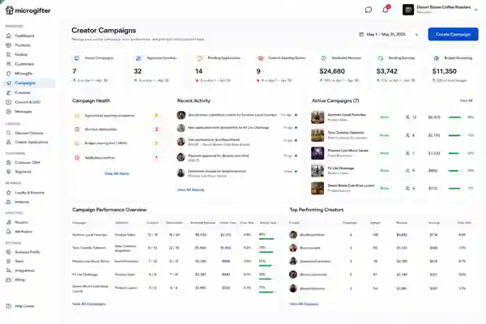
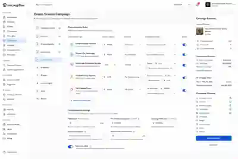
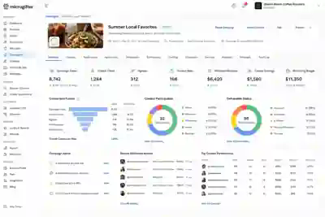

# Microgifter Brand–Creator Campaign System

This folder preserves the approved planning package for Microgifter's unified Brand–Creator Campaign System.

It is documentation and design reference only. It does not add or activate production code, routes, permissions, APIs, or database migrations.

## Feature summary

Microgifter merchants act as brands and create campaigns for approved Microgifter Creators. A campaign may combine UGC, product promotion, referrals, signups, product sales, Microgift sales, claims, redemptions, fixed deliverable payments, commissions, bonuses, and measurable CRM attribution.

Canonical operating chain:

```text
Merchant → Campaign → Creator → Agreement → Deliverable or Tracking Source
→ Customer Interaction → CRM Attribution → Creator Earning → Payout
```

The existing Creator model is the only active creator participant model. Creator specialties such as UGC Creator, Affiliate, Influencer, Brand Ambassador, Referral Partner, Community Partner, and Local Promoter are labels and eligibility metadata rather than new global roles.

Only active approved Creators may discover campaigns, apply, receive invitations, accept agreements, access tracking tools, submit work, or earn compensation.

## Planning documents

- [Complete system specification](CREATOR_CAMPAIGN_SYSTEM_SPECIFICATION.md)
  - Product purpose
  - Role and identity rules
  - Campaign Builder
  - Merchant workspace
  - Creator workspace
  - Agreements
  - Deliverables
  - Tracking
  - CRM attribution
  - Earnings
  - Payouts
  - Initial release boundary

- [Database, API, permissions, and service outline](CREATOR_CAMPAIGN_DATABASE_API_OUTLINE.md)
  - Proposed tables
  - Table relationships
  - Data integrity rules
  - Agreement snapshots
  - Tracking and attribution
  - Earnings and budget ledger
  - API route families
  - Permission catalog
  - Service boundaries
  - Transaction boundaries
  - Security and implementation sequence

- [UI mockup guide](CREATOR_CAMPAIGN_UI_MOCKUPS.md)
  - Approved Microgifter visual direction
  - Screen inventory
  - Shared UI components
  - Existing-shell implementation note

- [UI prompt library](CREATOR_CAMPAIGN_UI_PROMPTS.md)
  - Master visual prompt
  - Merchant overview prompt
  - Campaign Builder prompt
  - Merchant campaign detail prompt
  - Applications and content review prompt
  - Creator campaign discovery prompt
  - Creator active campaign workspace prompt

## Approved visual direction

Use the existing Microgifter look and feel:

- Light professional interface
- White and soft-gray surfaces
- Strong black typography
- Restrained blue accents
- Rounded cards and panels
- Subtle borders and shadows
- Dense but readable operational layouts
- Real campaign, creator, product, CRM, attribution, and earnings information
- Existing Microgifter shared header, footer, sidebar, forms, buttons, and responsive behavior in production

The generated header and footer are not authoritative. The main content area is the approved design reference.

## Mockups

### Merchant Creator Campaign overview



### Campaign Builder — Compensation



### Merchant campaign detail



### Complete approved screen set

The reference sheet includes:

1. Merchant Creator Campaign overview
2. Campaign Builder compensation step
3. Merchant campaign detail
4. Creator applications and content review
5. Creator campaign discovery
6. Creator active campaign and earnings workspace


## Campaign Builder structure

1. Campaign Details
2. Products and Offers
3. Creator Eligibility
4. Deliverables
5. Compensation
6. Attribution
7. Budget and Limits
8. Content Rights
9. Terms and Disclosures
10. Review and Publish

## Initial production boundary

The first release should include:

- Campaign creation and publication
- Approved Creator discovery
- Applications and existing-account invitations
- Creator participants
- Immutable versioned agreements
- Multiple deliverables
- Content submissions and revisions
- Creator tracking links, referral codes, and QR codes
- CRM attribution
- Fixed and performance compensation
- Earnings ledger and manual approval
- Budget controls
- Manual payout records
- Merchant and Creator workspaces
- Messages, basic disputes, and analytics

Deferred capabilities include automated external payouts, agency accounts, multi-creator commission splitting, social-network API ingestion, automatic publication verification, anonymous cross-device matching, AI creator matching, advanced fraud scoring, and legacy Marketing Affiliate integration.

## Core integrity rule

Every creator payment must remain traceable to:

- Merchant
- Campaign
- Creator participant
- Accepted agreement version
- Deliverable or tracking source
- Customer or content event
- Attribution decision
- Compensation rule
- Earning calculation
- Merchant approval
- Payout record
